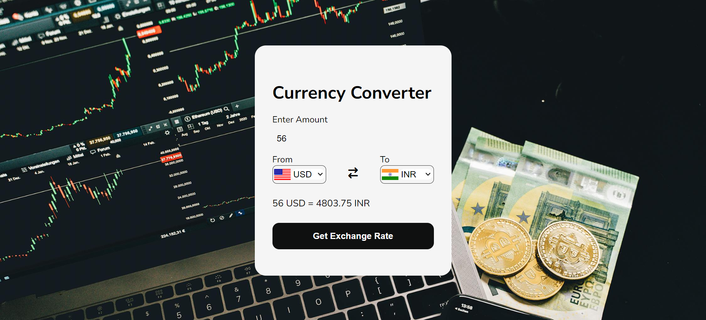

# Currency Converter  

## Description  
This is a simple **Currency Converter** web application that allows users to convert amounts between different currencies in real time. It fetches the latest exchange rates using a **Currency API** and provides a user-friendly interface for quick conversions.  

---

## Features  
- Real-time currency exchange rate updates.  
- Conversion between multiple currencies.  
- Clean and responsive user interface.  

---

## Technologies Used  
- **HTML:** Structure of the application.  
- **CSS:** Styling for a visually appealing and responsive design.  
- **JavaScript:** Logic for fetching API data and handling conversions.  

---

## How It Works  
1. Enter the amount you want to convert.  
2. Select the source and target currencies.  
3. Click the "Convert" button to see the converted amount using the latest exchange rates.  

---

## Setup Instructions  
1. Clone the repository or download the project files.  
2. Open the `index.html` file in your browser.  
3. Ensure you have an internet connection to fetch live exchange rates from the API.  

---

## API Used  
- The application uses a **Currency API** to fetch live exchange rates. Replace the API key in the JavaScript file with your own to access the data.  

---

## Future Enhancements  
- Add more currencies and additional features like historical data or graphs.  
- Improve error handling for failed API requests.  
- Implement offline functionality using cached rates.  

---
## Screenshot

